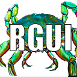
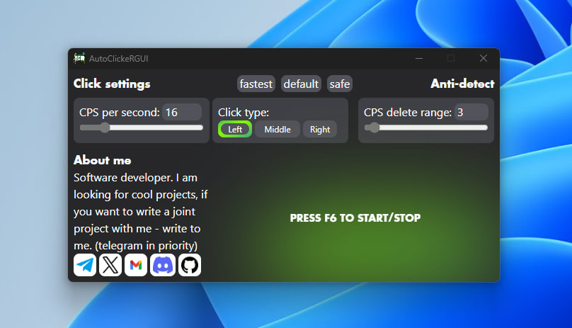

  
  
  # AutoClickeRGUI   
  
     
  This is a quick autoclicker written in Rust.
  The development path is opensourse.
  If you want to contribute to the development,   
  you can [write to me](https://t.me/leofaraf) or contribute to this project yourself!

### Currently creating support for MasOC and Linux
Location the release build `/src-tauri/target/release/`

